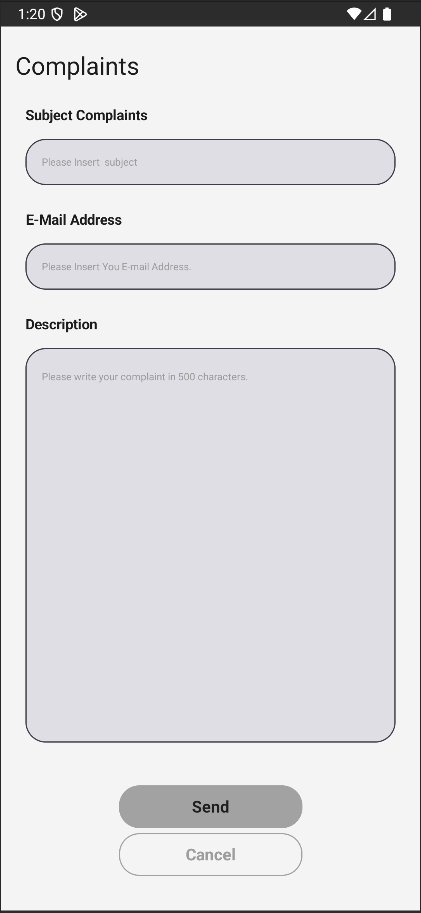
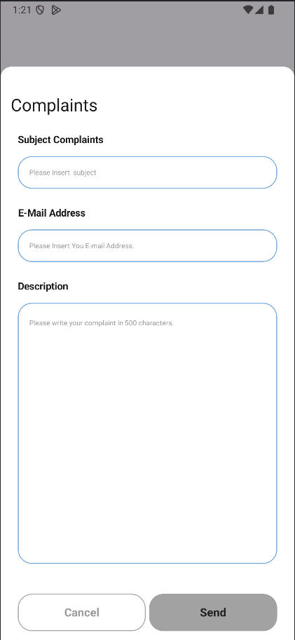

# ContactSupportKit-Android

A lightweight, customizable Android SDK (Jetpack Compose) to let users contact support from inside your app. It provides three ready-made UI styles, robust networking with retries, error handling, and a simple integration API.

[](https://jitpack.io/#ControlKit/ContactSupportKit-Android)

## Features
- **Three UI styles**: `FullScreen1`, `Popover1`, `Popover2`
- **Highly customizable UI** via `ContactSupportViewConfig`
- **Easy integration** with a single `contactSupportKitHost` composable
- **Robust networking**: Retrofit + OkHttp with retry/interceptor
- **MVVM** with `ViewModel` and `StateFlow`
- **Error handling** using a pluggable error entity model

## Installation

### 1) Add JitPack repository
Add to your root `settings.gradle.kts`:
```kotlin
pluginManagement {
    repositories {
        google()
        mavenCentral()
        gradlePluginPortal()
    }
}

dependencyResolutionManagement {
    repositoriesMode.set(RepositoriesMode.FAIL_ON_PROJECT_REPOS)
    repositories {
        google()
        mavenCentral()
        maven { url = uri("https://jitpack.io") }
    }
}
```

### 2) Add the dependency
In your app module `build.gradle.kts`:
```kotlin
dependencies {
    implementation("com.github.ControlKit:ContactSupportKit-Android:<latest-version>")
}
```
Check the badge above for `<latest-version>`.

### 3) Configure API endpoint
Set `API_URL` in your project `local.properties` (root of the project):
```properties
API_URL=https://your-domain.com/api/contacts
```
The library reads this value at build time (via `BuildConfig.API_URL`).

## Quick Start

```kotlin
import com.sepanta.controlkit.contactsupportkit.contactSupportKitHost
import com.sepanta.controlkit.contactsupportkit.config.ContactSupportServiceConfig
import com.sepanta.controlkit.contactsupportkit.view.config.ContactSupportViewConfig
import com.sepanta.controlkit.contactsupportkit.view.config.ContactSupportViewStyle

@Composable
fun MyScreen() {
    val kit = contactSupportKitHost(
        config = ContactSupportServiceConfig(
            version = "1.0.0",
            appId = "your-app-id",
            viewConfig = ContactSupportViewConfig(
                viewStyle = ContactSupportViewStyle.FullScreen1
            )
        ),
        onDismiss = {
            // user closed the dialog
        },
        onState = { state ->
            // observe ViewModelState (Success, Error, NoContent, Initial)
        }
    )

    // Show dialog when needed
    LaunchedEffect(Unit) { kit.showView() }
}
```

## Service Configuration
`ContactSupportServiceConfig` controls network and identity:
```kotlin
data class ContactSupportServiceConfig(
    var viewConfig: ContactSupportViewConfig = ContactSupportViewConfig(),
    var version: String = "1.0.0",  // your app version
    var appId: String,               // sent as x-app-id header
    var deviceId: String? = null,    // auto-generated if null
    var timeOut: Long = 5000L,       // HTTP timeout (ms)
    var timeRetryThreadSleep: Long = 1000L, // delay between retries (ms)
    var maxRetry: Int = 5,
)
```
- If `deviceId` is null, the SDK generates and persists a unique ID.
- Headers automatically sent on each request: `Accept`, `Authorization`, `platform`, plus `x-app-id`, `x-version`, `x-device-uuid`, `x-sdk-version`.

## View Configuration
`ContactSupportViewConfig` offers extensive UI customization. Minimal example:
```kotlin
val viewConfig = ContactSupportViewConfig(
    viewStyle = ContactSupportViewStyle.Popover1,
    headerTitle = "Contact Support",
    submitButtonTitle = "Send",
    cancelButtonTitle = "Cancel"
)
```
Advanced example with custom colors, shapes, and composables:
```kotlin
val advancedConfig = ContactSupportViewConfig(
    viewStyle = ContactSupportViewStyle.Popover2,
    popupViewCornerRadius = 16.dp,
    popupViewBackGroundColor = Color.White,

    headerTitle = "Send us a message",
    subjectTitle = "Subject",
    emailTitle = "Email",
    descriptionTitle = "Description",

    submitButtonTitle = "Send",
    cancelButtonTitle = "Cancel",

    submitButtonColor = ButtonDefaults.buttonColors(containerColor = Color(0xFF1976D2)),
    cancelButtonColor = ButtonDefaults.buttonColors(containerColor = Color.Transparent),

    // Optional custom composables
    headerTitleView = { title -> Text(title, style = Typography.titleLarge) },
    submitButtonView = { onClick ->
        Button(onClick = onClick) { Text("Submit") }
    },
    cancelButtonView = { onClick ->
        Button(onClick = onClick, colors = ButtonDefaults.buttonColors(Color.Transparent)) {
            Text("Cancel")
        }
    }
)
```

## UI Styles
- **FullScreen1**

  

- **Popover1**

  

- **Popover2**

  

## Usage Patterns

### 1) Show on demand (button click)
```kotlin
val kit = contactSupportKitHost(config)
Button(onClick = { kit.showView() }) {
    Text("Contact Support")
}
```

### 2) Auto show on screen open
```kotlin
val kit = contactSupportKitHost(config)
LaunchedEffect(Unit) { kit.showView() }
```

### 3) Handle state changes
```kotlin
val kit = contactSupportKitHost(
    config,
    onState = { state ->
        when (state) {
            is ViewModelState.Success -> { /* show success */ }
            is ViewModelState.Error -> { /* show error */ }
            ViewModelState.NoContent -> { /* server returned no content */ }
            else -> Unit
        }
    }
)
```

## API Behavior
- Uses `POST` to the URL from `API_URL` (no path hardcoded) and sends form fields:
  - `subject`, `email`, `message`
- Adds headers: `x-app-id`, `x-version`, `x-device-uuid`, `x-sdk-version`.
- Network client has retry logic for connectivity/timeout errors.

## Requirements
- Min SDK 24+
- Target SDK 36
- Kotlin 1.9+
- Jetpack Compose 1.4+

## License
See `LICENSE`.
